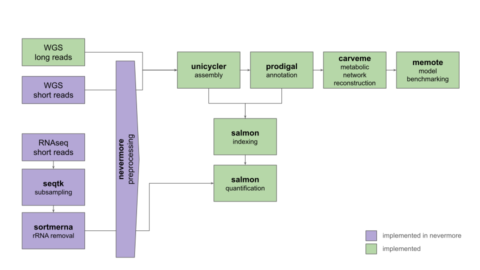

MultiPath
=========

`UC-Multi` (UseCase Multi-omics) is a multi-omics [workflow](https://github.com/mdsufz/MULTI) originally developed at the Helmholtz Centre for Environmental Research GmbH (UFZ) as a use-case for  [NFDI4Microbiota](https://nfdi4microbiota.de/). `MultiPath` is a nextflow-port developed at EMBL Heidelberg, powered by the independent [nevermore](https://github.com/cschu/nevermore) workflow component library.

### Collaborators

#### Bork Group EMBL Heidelberg
Christian Schudoma, Shahriyar Mahdi Robbani, Daniel Podlesny

#### UFZ
Stefania Magnusdottir, Ulisses Nunes da Rocha

Dependencies
------------

We recommend running `MultiPath` with Docker/Singularity. By default, it makes use of the biocontainers versions of its dependencies (with the exception of bwa/samtools, s. below)

### Essential/Mandatory

* Unicycler
* prodigal
* salmon
* carveme
* memote (note that nextflow versions >= 23 have problems with the memote container, s. usage)
* seqtk

### Optional

* bbmap (bbduk, reformat)
* kraken2
* sortmeRNA
* FastQC
* MultiQC

